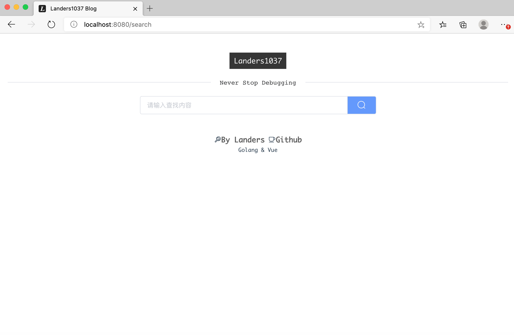
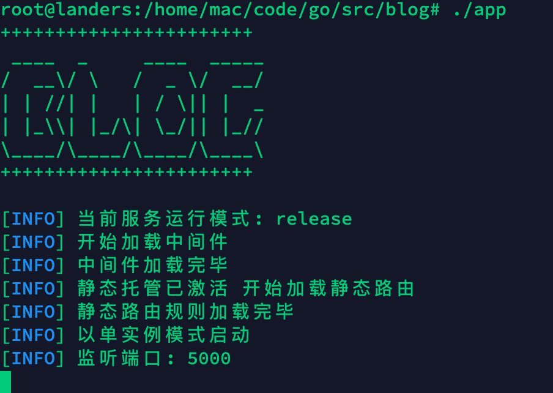

# blog

   

`blog` is a go&amp;vue blog using markdown

`blog`是一个基于go的后端markdown渲染服务，搭配vue实现的前端页面共同组成一个完整的个人博客发布服务

旨在提供markdown文本的博客部署服务

如果你在使用markdown写作 请尝试使用本服务

## 开发记录

[records](record/record.md)

## 图示







## 特性🛸

- 完整的迁移工具链 不管你是使用纯净的markdown还是hexo格式md
- markdown文本的语法高亮支持
- 高级统计功能 支持统计总访问量，文章访问量，文章分享量，文章点赞量
- 支持博客留言 文章的评论功能
- 支持多种排序准则 可以按照自己的方式选择想要的文章显示顺序
- 完善的后台管理页面，方便管理者管理数据
- 支持新文章的上传和文章的导出功能 随时备份你的博客
- 多数据库支持 关系型数据库（sqlite，mysql）
- 缓存支持 支持redis缓存 后期将更换为我的开源项目[Plnack](https://github.com/landers1037/plnack)
- 新特性.env定制环境变量
- 前端支持定制页面 定制不同区域的显示效果

本服务前端依赖nginx服务或者其他静态文件服务器，如果你只想要直接运行，请clone本库的br_ng分支

br_ng分支提供了静态文件的直接代理

## 使用🦄️

启动本服务，你可以在release页面下载本服务包，拷贝到你的服务器上或者本机运行

> 注意：win_amd64版本不支持需要linux特性，仅可作为本地调试使用

```bash
unzip blog_xxx.zip
cd blog_xxx
chmod +x blog
./blog
```

服务包内预置了程序启动需要的配置文件，你可以自定义此文件以实现不同的配置

### 命令

本服务内置了方便直接使用的命令（仅支持unix）

```bash
./blog -h # 查看帮助信息
Usage of ./blog:
  -h    查看帮助信息
  -p string
        选择监听端口
  -r    重载配置文件
  -s string
        操作服务进程
  -t    是否开启测试模式
  -v    查看版本信息
```

注意`-p`参数需要结合配置文件的`cluster`属性使用

当`cluster`为`1`时 使用集群模式，此时服务将支持使用`-p`参数监听多个端口启动多个子示例线程

如：

```bash
./blog -p "8888 9999"
# 服务将运行监听于端口8888 9999
```

#### 启动服务

```bash
./blog -s start
# 此命令将启动后台服务，日志记录于配置文件中定义的路径 进程pid同
```

#### 停止服务

```bash
./blog -s stop
```

#### 重启服务

```bash
./blog -s restart
```

#### 重载配置文件

```bash
./blog -r
```

#### 测试模式

```bash
./blog -t
# 一般用于调试时使用 测试模式下监听于5000端口
```

## 配置文件🔨

本服务的配置文件路径为`conf/app.ini`

如下：

```ini
# config for app
# mode can be debug/release
[mode]
RUN_MODE = debug

[run]
APP_NAME = blog
APP_PID = blog.pid
APP_LOG = blog.log
APP_LOG_LEVEL = error
APP_LOG_FILE = app.log
APP_LOG_ENABLE = 1

[app]
PAGE_SIZE = 8
MESSAGE_SIZE = 5
SORT_POST_BY = id
SORT_POST_REVERSE = 1
SORT_MESSAGE_BY = id
SORT_MESSAGE_REVERSE = 1
SORT_COMMENT_BY = id
SORT_COMMENT_REVERSE = 1
USE_CONTENT_AS_ABS = 1
MAX_CONTENT_LENGTH = 120
CUSTOM_EMPTY_ABS = <code>Sorry</code>该文章暂无概述
FAKE_STATIC_URL = 0
ZHUANLAN_ID = 1
JWT_SECRET = 10086call
APP_REFER = blog.renj.io
APP_HOST = 127.0.0.1
APP_DOMAIN = blog.renj.io
APP_ALLOW_IE = 0

[server]
HTTP_PORT = 5000
READ_TIMEOUT = 60
WRITE_TIMEOUT = 60
CLUSTER = 1
STATIC_ROUTER = 0

[admin]
USERNAME = admin
PASSWD = 12345
COOKIE_MAX_AGE = 3600

[mysql]
TYPE = mysql
USER = root
PASSWORD = 123456
HOST = 127.0.0.1:3306
NAME= blog
TABLE_PREFIX = blog_

# where db is
[sqlite]
DB = blog.db

# if use middleware set 1
[middle]
UV = 1
POSTVIEW = 1
SIMPLEAUTH = 0
USEREDIS = 0
CORS = 1
TRY_FILE = 0
TRY_FILE_INDEX = dist/index.html

[redis]
Host = 127.0.0.1:6379
Password =
MaxIdle = 30
MaxActive = 30
IdleTimeout = 200
EXPIRES = 60
POSTSTIMEOUT = 10
```

### 配置说明🚀

#### mode

运行的模式 参数可选debug，release。测试模式，发布模式

#### run

运行时配置，主要配置程序运行时的日志路径和pid路径

搭配`-s start`命令使用

`APP_NAME` 程序名称 帮助操作系统找寻此服务程序二进制文件

`APP_LOG` 程序的运行日志路径 支持绝对和相对路径（start命令需要的）

`APP_PID` 程序的pid路径 支持绝对和相对路径

`APP_LOG_LEVEL` 日志记录级别 可选error info

`APP_LOG_FILE` 基于文件的日志路径

`APP_LOG_ENABLE`  是否开启文件日志 默认关闭输出到终端

#### app

博客服务相关的配置

`PAGE_SIZE` 懒加载使用 用于配置每次响应的博客文章数目 默认8

`MESSAGE_SIZE` 懒加载使用 用于配置每次响应的留言数目 默认5

`SORT_POST_BY` 配置按照何种规则排序你的博客文章 支持(id, name, date, update, title)即主键，文章url，文章创建时间，文章更新时间，文件标题， 默认id

`SORT_POST_REVERSE` 配置是否反序排列

`SORT_MESSAGE_BY` 配置按照何种规则排序留言 支持(id, user, date)即主键， 留言用户，留言时间 默认id

`SORT_MESSAGE_REVERSE` 配置是否反序排列

`SORT_COMMENT_BY`   配置按照何种规则排序评论 支持(id, user, date, comment)即主键 留言用户，留言时间，留言内容 默认id

`SORT_COMMENT_REVERSE` 配置是否反序排列

`USE_CONTENT_AS_ABS` 配置是否使用文章正文代替摘要（仅在摘要为空时生效）

`MAX_CONTENT_LENGTH` 配置使用文章正文代替摘要时应该截取的长度

`CUSTOM_EMPTY_ABS` 配置当摘要为空时，应该显示的默认摘要内容（使用文章内容代替摘要开启时 此配置无效）

`FAKE_STATIC_URL` 配置是否启用伪静态地址 开启后所有的博客文章地址变为xxx.html的伪静态链接

`ZHUANLAN_ID` 专栏生成的url使用数字id还是使用英文url（当英文url不存在时自动使用id）

`JWT_SECRET` json web token使用的密钥

`APP_REFER` 防止滥用时开启 允许通过的请求头refer 多个时使用空格分开

`APP_HOST` 防止滥用时开启 允许通过的请求头host 多个时使用空格分开

`APP_DOMAIN` 用于生成cookie时确定cookie域名，在这里配置你的博客域名

`ALLOW_IE` 是否允许旧版IE浏览器访问本服务 0禁止 1允许

#### server

服务器相关配置

`HTTP_PORT` 服务运行的端口

`READ_TIMEOUT`  最大读取超时时间

`WRITE_TIMEOUT` 最大写入超时时间

`CLUSTER` 是否开启集群模式 0关闭 1开启

`STATIC_ROUTER` 是否使用blog代理前端的静态文件 在本机测试时可以使用 部署时建议使用nginx托管静态文件（开启后在conf/router.json文件中添加需要托管的文件路由）

#### admin

后台控制页面相关配置

`ADMIN` 管理员用户名

`PASSWD` 管理员密码

`COOKIE_MAX_AGE` 用户认证的cookie超时时间 默认1800s

#### mysql

mysql数据库定制配置

#### sqlite

sqlite数据库配置

`DB` 服务的sqlite数据库位置

#### middle

中间件相关配置

`UV` 是否开启全局访问量统计 0关闭 1开启

`POST_VIEW` 是否开启文章的访问量统计 0关闭 1开启

`SIMPLE_AUTH` 是否开启简单请求过滤，用于防止接口滥用 仅允许指定refer和host请求通过

`CORS` 是否开启跨域请求 注意关闭时来自不同域的请求会被拦截

`USEREDIS` 是否启用redis前置缓存 需要配置redis

`TRY_FILE` 在不使用nginx直接由本服务代理前端页面时生效类似nginx的`try_file`指令

`TRY_FILE_INDEX` 重定向的前端主页文件

> 注意⚠️：由于try机制目前不够完善，只能自动获取所有非/api的请求重定向到前端页面，静态资源路径如：js / css并未注册在blog中会导致无法正常使用所以需要搭配`router.json`使用
>
> 你只需要简单的配置静态资源路径 并且开启`STATIC_ROUTER`即可
>
> ```json
>   [{
>     "path": "/css",
>     "type": "dir",
>     "alias": "dist/css"
>   }]
> ```
>
> 

#### redis

redis相关配置

`Host` redis的地址
`Password` redis的密码为空时 不需要填写
`MaxIdle` = redis最大空闲
`MaxActive` = redis连接池最大连接数
`IdleTimeout` = redis最大空闲超时时间
`EXPIRES` = redis内部键值对过期时间 单位s
`POSTSTIMEOUT` = 最大请求超时时间

## 如何托管静态文件🌴

本服务支持直接托管前端的静态文件，让你无需使用nginx的反向代理机制

此功能应该仅作为本机测试使用而非正式的发布版本

**conf/router.json**

定义这个数组文件 在内部定义并实现你的路由

```json
[
  {
    "path": "/",
    "type": "file",
    "alias": "dist/index.html"
  },
  {
    "path": "/about",
    "type": "try",
    "alias": "dist/index.html"
  },
  {
    "path": "/img",
    "type": "dir",
    "alias": "dist/img"
  }
]    
```

路由配置分为三个参数`path`, `type`, `alias` 

`path` 路由的绝对路径

`type` 路由类型 file即单文件托管，dir即托管一个文件夹 实现同nginx的alias，try即需要将请求重定向到主页的路由

try参数解释：

实现类似nginx的`try_files`参数，在请求的路由实际不存在于后端时将路由交给前端的html页面处理。例如vue-router这种前端路由状体组件，本服务的对于此功能的实现并不足够智能，需要你指定需要返回前端处理的路由

当`middle`中的`TRY_FILE`开启时 同时也支持本json文件中定义的路由

`alias` 文件在服务器上的真实路径 支持绝对和相对路径，相对路径以本二进制程序所在路径为`.`

示例：type为dir时 假设path配置为`/img` 此时访问`/img/test.png`实际请求文件为`dist/img/test.png`

## 定制前端页面🌍

博客服务的前端配置指导文档

博客前端服务由vue技术栈编写 支持界面的定制化

### 使用方式

需要定义请clone本项目的front分支 进行修改编译

```bash
git clone https://github.com/Landers1037/blog.git -b br_front
```

### 定制属于自己的服务

### 定制页面

**custom.js**

```javascript
// 可自由定制的项目
// 在打包的时候使用
const customData = {
    api_url: "http://127.0.0.1:5000",
    author: "Landers",
    top_banner: "Landers1037",
    top_span: "Never Stop Debugging",
    site_name: "renj.io",
    site_url: "http://renj.io",
    github: "landers1037",
    project: "mgek.cc",
    project_des: "Mgek项目记录生活中的灵感",
    project_url: "http://mgek.cc",
    bottom_tag: "By Landers",
    bottom_url: "http://renj.io",
    bottom_tag2 : "Github",
    bottom_url2: "https://landers1037.github.io",
    bottom_span: "Golang & Vue",
    email: "mail@renj.io",
    start_year: "2017",
    start_date: "2017/7/1",
    dashboard_count: 5
}
```

### 参数解析⚙️

`api_url` 需要请求的后端接口地址 正式发布时例如`https://api.xxx.com`

`author` 作者名称 显示在页面右侧栏的作者名 写上你的昵称

`top_banner` 顶部一级标题

`top_span` 顶部的自定义标语

`site_name` 右边栏可以自定义的你的网站名称

`site_url` 右边栏可以自定义的你的网站地址 点击后可以跳转

`github` 你的githb名称 只需要你的账户名称

`project` 右边栏可以定制的你的项目名称

`project_url` 右边栏可以定制的你的项目url 可以填你的github **不填写则不会跳转**

`project_des` 右边栏关于你的项目的描述

`bottom_tag`底部标签 左标签名称

`bottom_url` 底部标签 左标签的url为空时则忽略 否则可以点击跳转

`bottom_tag2` 底部标签 右标签的名称

`bottom_url2` 底部标签 右标签的url为空时则忽略 否则可以点击跳转

`bottom_span` 底部子标签 自定义内部语句支持emoji **为空时则不显示**

`email` 你的电子邮箱

`start_year`  显示在状态弹框中的开始年份 请在这里填上开始写博客的年份

`start_date` 用于计算具体的距离开始写博客的时间 请填写如下格式`YYYY/mm/dd`

`dashboard_count` 设置点击头像后经过多少次计数才会进入后台控制页面，因为本博客不提供显式的直接登陆页面，所以在经过正确点击次数后才会显示管理员的登陆页面

### 定制样式👗

**custom.css**

在此文件中定制你的样式 注意这里定义的样式时全局生效的

```css
// 博客文章以及摘要中出现的code代码块高亮颜色
.markdown-body p code{
    background-color: #808080;
    color: #ffffff;
}

// 主页的博客标题颜色
.post .post-a{
    color: #409eff;
}

// 主页的博客标题在鼠标放置时变化的颜色
.post .post-a:hover{
    color: #2f343f;
}

// 主页的博客摘要中摘要文字的颜色
.post .abstract{
    color: #3f3f3f;
}

// 右边栏中的标签主题颜色
.el-tag--dark.el-tag--success{
    background-color: #6aaaaa;
    border-color: #6aaaaa;
}
```

值得注意的是：

在此文件中默认预置的主题外 你还可以通过f12查看页面源码自由定制页面

在此文件中写的所有css都会覆盖之前的样式

## 迁移🚛

怎么从markdown文件迁移到本服务？

本服务提供一些简单易用的迁移工具 让你一键从md转移，如果你使用的是hexo生成的md文件

那么恭喜你的md文件规范和本服务相似

### md文件规范📃

```markdown
---
title: 文章标题
name: 文件名
date: 2021-02-27 01:09:52
id: 文章的id
tags: 标签
categories: 分类
abstract: 暂时无用
---
摘要
<!--more-->

正文
---
这是分割线
---
```

md文件头部使用和hexo类似的`yaml`标签信息

注意：暂不支持换行 一行为一个meta信息

`title` 文章要显示在主页的标题

`name` 文章的唯一名称 用于生成跳转url 为避免中文url的转义请使用英文

`id` 自动生成 文章的顺序 显示文章的时候使用

`tags` 数组形式[tag1, tag2, tag3]

`categories` 数组形式[cate1, cate2, cate3]

`abstract` 暂时无用 摘要 因为摘要从下面的内容中读取

#### 摘要获取

在文章中定义的`<!--more-->` more前面的内容就是摘要信息

摘要也可以为markdown文本 支持语法高亮

不存在或者为空时 则默认没有摘要


#### 正文内容

正文 = 摘要 + 正文内容

所以说摘要也是文章的一部分

#### 迁移工具

当前支持全量和增量迁移的工具`jjtool`

支持全量迁移的工具python脚本`migrate_blog.py`

### 迁移图床基础地址

blog提供命令行工具帮助完成文件中的图片链接迁移工作

```bash
blog -m old_link new_link
```

使用`-m`参数指定迁移，填入旧的链接地址和新的链接地址即可完成迁移

## 使用docker镜像

你可以自行构造镜像或者是使用dockerhub上的镜像

```bash
docker pull landers1037/blog:latest

docker run -d -p 5000:5000 -v /home/conf:/app/conf -v /home/data:/app/data blog:latest
```

blog需要挂载两个路径conf和data

conf目录用于编写用户自定义的配置文件

data用于存放运行时的数据库和日志数据，你可以随时备份此数据

默认html静态文件会打包在容器内部的`/app/html`路径，如果你想自行编译前端文件请挂载此路径

```bash
-v /home/html:/app/html
```

在不挂载conf目录时blog不会主动生成配置文件会导致无法运行，请预先定义好app.ini配置文件

`app.ini`

```ini
# config for app
# mode can be debug/release
[mode]
RUN_MODE = release

[run]
APP_NAME = blog
APP_PID = /app/data/blog.pid
APP_LOG = /app/data/blog.log
APP_LOG_LEVEL = error
APP_LOG_FILE = /app/data/app.log
APP_LOG_ENABLE = 1

[app]
PAGE_SIZE = 8
MESSAGE_SIZE = 5
SORT_POST_BY = id
SORT_POST_REVERSE = 1
SORT_MESSAGE_BY = id
SORT_MESSAGE_REVERSE = 1
SORT_COMMENT_BY = id
SORT_COMMENT_REVERSE = 1
USE_CONTENT_AS_ABS = 1
MAX_CONTENT_LENGTH = 120
CUSTOM_EMPTY_ABS = <code>Sorry</code>该文章暂无概述
FAKE_STATIC_URL = 0
ZHUANLAN_ID = 1
JWT_SECRET = 10086call
APP_REFER = blog.renj.io
APP_HOST = 127.0.0.1 blog.renj.io
APP_DOMAIN = blog.renj.io
APP_ALLOW_IE = 0

[server]
HTTP_PORT = 5000
READ_TIMEOUT = 60
WRITE_TIMEOUT = 60
CLUSTER = 1
STATIC_ROUTER = 1

[admin]
USERNAME = admin
PASSWD = 12345
COOKIE_MAX_AGE = 3600
STOP_ADMIN = 0

[mysql]
TYPE = mysql
USER = root
PASSWORD = 123456
HOST = 127.0.0.1:3306
NAME= blog
TABLE_PREFIX = blog_

# where db is
[sqlite]
DB = /app/data/blog.db

# if use middleware set 1
[middle]
UV = 0
POSTVIEW = 0
SIMPLEAUTH = 0
USEREDIS = 0
CORS = 1
TRY_FILE = 1
TRY_FILE_INDEX = /app/html/index.html

[redis]
Host = 127.0.0.1:6379
Password =
MaxIdle = 30
MaxActive = 30
IdleTimeout = 200
EXPIRES = 60
POSTSTIMEOUT = 10
```

为了保护你的数据`/app/data`路径最好选择非容器内部存储空间

**默认的配置文件会放置在/app/example目录下**

### 使用不同命令启动容器

默认的重启方式是指定端口的前台运行，使用docker的`-d`参数以保持后台运行

你可以使用blog支持的命令行参数

## Bench mark

压力测试

#### wrk基准测试

| 模式   | 接口       | 并发连接数 | 结果     | 压力值         |
| ------ | ---------- | ---------- | -------- | -------------- |
| 平均   | /api/test/ | 8.98k/s    | 21.38ms  | 1线程 100并发  |
| 最大   | /api/test/ | 15.39k/s   | 263.18ms | 1线程 100并发  |
| 标准差 | /api/test/ | 6.14k/s    | 29.16ms  | 1线程 100并发  |
| 平均   | /api/test/ | 6.07k/s    | 56.40ms  | 2线程 1000并发 |
| 最大   | /api/test/ | 8.33k/s    | 737.51ms | 2线程 1000并发 |
| 标准差 | /api/test/ | 1.33k/s    | 71.62ms  | 2线程 1000并发 |

```bash
Running 10s test @ http://127.0.0.1:5000/hello
  1 threads and 100 connections
  Thread Stats   Avg      Stdev     Max   +/- Stdev
    Latency    53.38ms   54.25ms 496.91ms   85.81%
    Req/Sec     2.31k     2.59k   13.93k    93.00%
  22963 requests in 10.01s, 10.75MB read
Requests/sec:   2295.02
Transfer/sec:      1.07MB
```

#### webbench基准测试

| 客户端数 | 测试时长(s) | 速度             | 响应结果 （成功/失败） |
| -------- | ----------- | ---------------- | ---------------------- |
| 100      | 10          | 88530 pages/min  | 14755/0                |
| 200      | 10          | 104454 pages/min | 17409/0                |
| 300      | 10          | 91830 pages/min  | 15305/0                |
| 100      | 20          | 89790 pages/min  | 29930/0                |
| 500      | 20          | 88587 pages/min  | 29529/0                |
| 200      | 50          | 46214 pages/min  | 38512/0                |

```bash
Webbench - Simple Web Benchmark 1.5
Copyright (c) Radim Kolar 1997-2004, GPL Open Source Software.

Request:
GET /hello HTTP/1.0
User-Agent: WebBench 1.5
Host: 127.0.0.1


Runing info: 100 clients, running 10 sec.

Speed=88530 pages/min, 724470 bytes/sec.
Requests: 14755 susceed, 0 failed.
```


## dependency

本项目依赖

- gin
- godotenv
- go-ini
- gorm
- vue